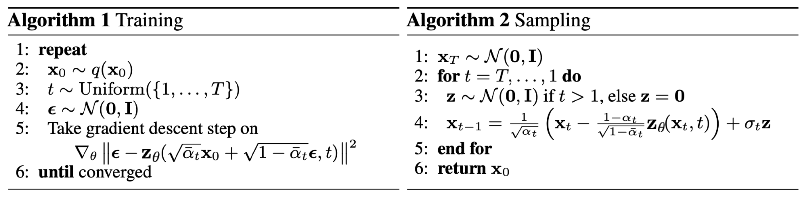
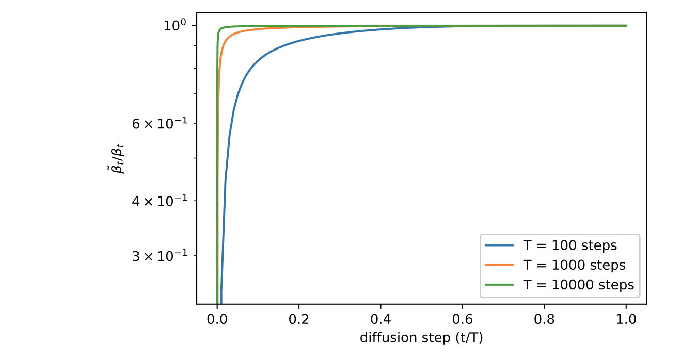

# DDPM: Denoising Diffusion Probabilistic Models
## 0. Architecture

## 1. Diffusion Process
Based of **base assumption** and **reparameterization trick**:

$$
\begin{aligned}
x_t &\sim \mathcal{N}(\alpha_t x_{t-1}, \beta_t^2I) \\
x_t &= \alpha_tx_{t-1} + \beta_t \varepsilon_t, &\varepsilon_t \sim \mathcal{N}(0, I)
\end{aligned}
$$

**Note that** similarly we have $x_{t-1} = \frac{1}{\alpha_t}x_t - \frac{\beta_t}{\alpha_t}\varepsilon_t$, which indicate that each step of **reverse diffusion process** is stiil a gaussion distrubution.
Further, to observe $p(x_t | x_0)$, we have:

$$
\begin{aligned}
x_t &= \alpha_tx_{t-1} + \beta_t \varepsilon_t , &\text{condition on observation of } x_{t-1}\\
&= \alpha_t(\alpha_{t-1}x_{t-2} + \beta_{t-1}\varepsilon_{t-1}) + \beta_t\varepsilon_t \\
&= \alpha_t\alpha_{t-1}x_{t-2} + (\alpha_t\beta_{t-1}\varepsilon_{t-1} + \beta_t\varepsilon_t) \\
&= \alpha_t\alpha_{t-1}x_{t-2} + \sqrt{\alpha_t^2\beta_{t-1}^2 + \beta_t^2}\bar{\varepsilon}_{t:t-1}
\end{aligned}
$$

Given that $\alpha_t^2 + \beta_t^2 = 1$, the we have:
$$
\begin{aligned}
x_t &= \alpha_t\alpha_{t-1}x_{t-2} + \sqrt{\alpha_t^2\beta_{t-1}^2 + \beta_t^2}\bar{\varepsilon}_{t:t-1} \\
&= \alpha_t\alpha_{t-1}x_{t-2} + \sqrt{\alpha_t^2(1 - \alpha_{t-1}^2) + (1-\alpha_t^2)}\bar{\varepsilon}_{t:t-1} \\
&= \alpha_t\alpha_{t-1}x_{t-2} + \sqrt{1 - \alpha_t^2\alpha_{t-1}^2}\bar{\varepsilon}_{t:t-1} \\
&= \cdots \\
&= \Pi_{i=1}^{T}\alpha_ix_0 + \sqrt{1 - \Pi_{i=1}^T\alpha_i^2}\bar{\varepsilon}_t, &\text{condition on observation of } x_0
\end{aligned}
$$
Let $\bar{\alpha}_t = \Pi_{i=1}^{T}\alpha_i$ and $\bar{\beta}_t=\sqrt{1 - \Pi_{i=1}^T\alpha_i^2}$, we still have $\bar{\alpha}_t^2 + \bar{\beta}_t^2 = 1$, fanilly we have:
$$
\begin{aligned}
x_t &= \bar{\alpha}_tx_0 + \bar{\beta}_t\bar{\varepsilon}_t.
\end{aligned}
$$

**Note that** usually $0< \alpha_1 < \alpha_2 < \cdots < \alpha_T < 1$, and $\alpha_t$ is closed to 1.

when $T \rightarrow \infty$, $\bar{\alpha}_T \rightarrow 0$ and $\hat{\beta}_T \rightarrow 1$, further we have $x_T \sim \mathcal{N}(0, I)$.

## 2. Generation Process (Reverse Process)
#### A single step of reverse process
It is noteworthy that the reverse conditional probability is tractable when conditional on $x_0$:
$$
\begin{aligned}
q(x_{t-1}| x_t, x_0) \sim \mathcal{N}(\tilde{\mu}(x_{t}, x_0), \tilde{\beta}_t^2I)
\end{aligned}
$$
Using Bayes theorem, we have:
$$
\begin{aligned}
q(x_{t-1}| x_t, x_0) &= q(x_t|x_{t-1}, x_0)\frac{q(x_{t-1}| x_0)}{q(x_t|x_0)} \\
&\propto \text{exp}(-\frac{1}{2}(\frac{(x_t - \alpha_t x_{t-1})^2}{\beta_t^2} + \frac{(x_{t-1} - \bar{\alpha}_{t-1}x_0)^2}{\bar{\beta}_{t-1}^2} + \frac{(x_{t} - \bar{\alpha}_{t}x_0)^2}{\bar{\beta}_{t}^2})) \\
&= \text{exp}(-\frac{1}{2}(({\color{red}{\frac{\alpha_t^2}{\beta_t^2} + \frac{1}{\bar{\beta}_{t-1}^2}}})x_{t-1}^2 - 2({\color{blue}{\frac{\alpha_t}{\beta_t^2}x_t + \frac{\bar{\alpha}_t}{\bar{\beta}_{t-1}^2}}})x_{t-1} + C(x_t, x_0)))
\end{aligned}
$$

Following the standard Gaussian density function, the mean and variance can be parameterized as follow (recall that $\alpha_t^2 + \beta_t^2 = 1$ and $\bar{\alpha}_t^2 + \bar{\beta}_t^2 = 1$):
$$
\begin{aligned}
\tilde{\beta}_t^2 &= 1 / ({\color{red}{\frac{\alpha_t^2}{\beta_t^2} + \frac{1}{\bar{\beta}_{t-1}^2}}}) = \frac{\bar{\beta}_{t-1}^2}{\bar{\beta}_t^2}\beta_t^2 \\
\tilde{\mu_t} &= ({\color{blue}{\frac{\alpha_t}{\beta_t^2}x_t + \frac{\bar{\alpha}_t}{\bar{\beta}_{t-1}^2}}}) / ({\color{red}{\frac{\alpha_t^2}{\beta_t^2} + \frac{1}{\bar{\beta}_{t-1}^2}}}) = \frac{\alpha_t\bar{\beta}_{t-1}^2}{\bar{\beta}_t^2}x_t + \frac{\bar{\alpha}_{t-1}\beta_t^2}{\bar{\beta}_t^2}x_0
\end{aligned}
$$

Further, we can represent $x_0 = \frac{1}{\bar{\alpha}_t}(x_t - \bar\beta_t\bar{\varepsilon}_t)$ and plug into the above equation and obtaion:

$$
\begin{aligned}
\tilde{\mu_t} &= \frac{\alpha_t\bar{\beta}_{t-1}^2}{\bar{\beta}_t^2}x_t + \frac{\bar{\alpha}_{t-1}\beta_t^2}{\bar{\beta}_t^2} \frac{1}{\bar{\alpha}_t}(x_t - \bar\beta_t\bar{\varepsilon}_t) \\
&= \frac{1}{\alpha_t}(x_t - \frac{\beta_t^2}{\bar{\beta}_t}\bar{\varepsilon}_t)
\end{aligned}
$$

#### Analysis of predict target
Recall taht we need to learning a neural network to approximate the conditioned probability distributions in the reverse process, $x_{t-1} = \mu_\theta(x_t, t) x_t + \sigma \tilde{\varepsilon}_t$
- **a. Euclidean distance**

After the above derivation, we now analysis optimize target. A natural thinking is predict $x_{t-1}$ directly and minimize Euclidean distance:
$$
\begin{aligned}
L_t = \frac{1}{\sigma_t^2}\mathbb{E}\left[||x_{t-1} - \tilde{\mu}_\theta(x_t, t)||^2\right]
\end{aligned}
$$

Note that $\tilde{\mu}_\theta(x_t, t)$ is not a good predict target, and meanwhile $x_{t-1} = \frac{1}{\alpha_t}x_t - \frac{\beta_t}{\alpha_t}\varepsilon_t$ and $\tilde{\mu}_\theta(x_t, t)= \frac{1}{\alpha_t}x_t - \frac{\beta_t}{\alpha_t}\varepsilon_\theta(x_t, t)$, then we have:

$$
\begin{aligned}
L_t = \frac{\beta_t^2}{\sigma_t^2\alpha_t^2}\mathbb{E}\left[||\varepsilon_t - \varepsilon_\theta(x_t, t)||^2\right]
\end{aligned}
$$

Further, the prediction $\varepsilon_\theta(x_t, t)$ have not based on the observation of $x_0$. Since,

$$
\begin{aligned}
(x_t &= \bar{\alpha}_tx_0 + \bar{\beta}_t\bar{\varepsilon}_t) \\
x_t &= \alpha_tx_{t-1} + \beta_t\varepsilon_t \\
&= \alpha_t(\bar{\alpha}_{t-1}x_0 + \bar{\beta}_{t-1}\bar{\varepsilon}_t) + \beta_t\varepsilon_t \\
&= \bar{\alpha}_{t}x_0 + \alpha_t\bar{\beta}_{t-1}\bar{\varepsilon}_t + \beta_t\varepsilon_t
\end{aligned}
$$
Plug into our predict target:

$$
\begin{aligned}
L_t = \frac{\beta_t^2}{\sigma_t^2\alpha_t^2}\mathbb{E}\left[||\varepsilon_t - \varepsilon_\theta(\bar{\alpha}_{t}x_0 + \alpha_t\bar{\beta}_{t-1}\bar{\varepsilon}_t + \beta_t\varepsilon_t, t)||^2\right]
\end{aligned}
$$

- **b. KL divergence**

$$
\begin{aligned}
L_t &= D_{KL}(q(x_t | x_{t+1}, x_0) || p_\theta(x_t | x_{t+1})) \\
&= \frac{1}{2\sigma_t^2}\mathbb{E}\left[||\tilde{\mu}_t - \mu_\theta||^2\right] \\
&= \frac{1}{2\sigma_t^2}\mathbb{E}\left[||\frac{1}{\alpha_t}(x_t - \frac{\beta_t^2}{\bar{\beta}_t}\bar{\varepsilon}_t) - \frac{1}{\alpha_t}(x_t - \frac{\beta_t^2}{\bar{\beta}_t}\varepsilon_\theta(x_t, t))||^2\right] \\
&= \frac{\beta_t^4}{2\sigma_t^2\bar{\beta}_t^2}\mathbb{E}\left[||\bar{\varepsilon}_t - \varepsilon_\theta(\bar{\alpha}_tx_0 + \bar{\beta}_t\bar{\varepsilon}_t)||^2\right] \\
\end{aligned}
$$

#### Training and sampling algorithms

## 3. Parameters Setting
- About $\alpha_t$, $T$ 
$$
\begin{aligned}
&\alpha_t^2 + \beta_t^2 = 1 \\
&T = 1000 \\
&\alpha_t = \sqrt{1 - \frac{-0.02t}{T}} \\
&\text{log}\bar{\alpha}_t = \frac{1}{2}\sum_{t=1}^T \text{log}(1 - \frac{0.02t}{T}) < \frac{1}{2}\sum_{t=0}^T(-\frac{0.02t}{T}) = -0.006 (T + 1) \approx e^{-5}
\end{aligned}
$$

- About $\sigma_t$
$$
\begin{aligned}
& \sigma_t = \beta_t \\
& \sigma_t = \frac{\bar{\beta}_{t-1}}{\bar{\beta}_t}\beta_t
\end{aligned}
$$

